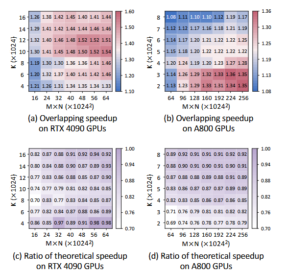

# 固定硬件配置

核层级：
|             | 含义                        | 取值     | 说明              |
| ----------- | --------------------------- | -------- | ----------------- |
| n_ctrl      | 控制核数                    | 1        |                   |
| r           | router 功能档位             | base     |                   |
| B           | 单 core 注入/单链路目标带宽 | 256 GB/s |                   |
| K           | 单 core SRAM 容量           | 3MB      |                   |
| B_s         | 单 core SRAM 聚合带宽       | 256 GB/s |                   |
| N_PE        | 矩阵 PE 数                  | 4096     | 对标8 TFLOPS/core |
| DTE_channel | DTE channel个数             | 2        |                   |

Die和Wafer层级：
|          | 含义                   | 取值 | 备注                   |
| -------- | ---------------------- | ---- | ---------------------- |
| core阵列 |                        | 4*4  |                        |
| e_H      | HBM 放置边数           | 2    |                        |
| m        | 每条 HBM 边的 stack 数 | 2    | 16GB/stack，因此是64GB |
| die阵列  |                        | 6*6  |                        |

# 实验思路

关闭inter-die优化，固定为1D ring swizzling且不做参数扫描

需要Swizzling原因：
inter-die swizzling 的本质就是"主动把跨die通信调度到和计算重叠的时间片里"，一旦关掉这个调度能力，跨die通信退化成阻塞式/整块传输，自然就和intra-die自己的片内计算-通信重叠"错峰"了，共享资源的争用会大幅减少（但严格说是"大幅降低"而非"完全消除"，下面会给一个低成本的稳健性检查）。

选1D ring swizzling原因：
对比三个候选方案：
| 方案                               | 问题                                                                      |
| -------------------------------- | ----------------------------------------------------------------------- |
| D=1（完全不跨die）                     | GEMM+RS / Dispatch+GEMM 这两个算子本身就是"跨die resharding"算子，D=1时算子不成立，等于换了题目   |
| 固定某一组 2D Row-Column Swizzling 参数 | 2D Swizzling 本身依赖 mesh 形状去搜参数，"固定哪一组"这个选择动作本身就是一种inter-die编排决策，没法叫"关掉"  |
| 1D Ring（你的方案）                    | 无参数——环形通信不需要针对mesh形状做任何搜索/调优，是拓扑无关、确定性、"不作为"的基线，正好对应"没有inter-die编排"这个语义 |

所以在笔记里应该明确写一句论证：1D Ring 之所以是合法的"inter-die=off"基线，不是因为它通信量最小，而是因为它是唯一一个不需要引入任何额外调度决策的选项（其余两个候选要么算子不成立，要么自身就带有编排决策）。

# 实验配置

Die Mesh阵列大小：2*3（这样才能成环）
测量算子：GEMM+RS

扫描范围：
| 轴               | 具体取值                                                                                               | 点数  | 说明                                                                                                     |
| --------------- | -------------------------------------------------------------------------------------------------- | --- | ------------------------------------------------------------------------------------------------------ |
| M×N（用 M 扫，N 固定） | N 固定 = GPT-3-175B 的 H = 12288（复用 Exp3.1 已选模型）；M ∈ {256, 512, 1024, 2048, 4096, 8192, 16384}，log 间隔 | 7   | 从明显延迟瓶颈到明显带宽瓶颈全覆盖                                                                                      |
| K               | {256, 1024, 4096, 16384, 65536}，log 间隔，故意扫到超出真实模型范围                                                | 5   | 真实 K（TP切分前的完整 hidden dim）一般在 4K~12K 区间；扫到 65536 是为了在热力图上明确定位理论 r=1 的位置，而不只停留在"真实模型恰好落在哪个区域"这个偏窄的 slice |
7×5=35 个网格点，每点测 (intra-die ON, OFF) 一对 → 35 组测量。

# 结果展示

每个网格点测一对——
- OFF：die内计算做完 → 结果搬到通信缓冲区 → 再交给1D Ring发出去（纯串行，无重叠）
- ON：本文提出的intra-die编排（片内计算与片内数据搬运做流水/重叠）
热力图的颜色值 = ON/OFF 的 speedup（或达成率），而不是单独两张热力图，这样和 FlashOverlap 的呈现方式、以及笔记里"达成率优于原始speedup"的原则都一致。

# 预期结果与Insights

预期结果：
① 热力图的主形态是"山脊/山峰"，不是"右上角最优"——这是本实验最重要、也最容易被想岔的一点
代入 r = T_comp/T_comm = [M·N·(K/D)] / [α+β·M·N]，令 r=1 解出峰值脊线方程：
需
对应 Speedup_max=(r+1)/max(r,1) 在 r=1 处取峰值2，向 r→0（通信瓶颈）和 r→∞（计算瓶颈）两个方向都单调回落到1。所以预期看到的不是"M×N和K越大越好"，而是一条沿双曲线状轨迹的峰值脊线贯穿网格，两侧都往下掉——这一点在写作里要专门强调，否则读者会本能地以为热力图应该是"右上角最亮"的单调渐变。
② 通信瓶颈角（小M×N）是陡峭截止，不是缓慢下降
α（固定延迟）主导时，哪怕K拉到65536，speedup也压在低值附近——因为此时通信时间几乎不随K变化，增大计算量并不能有效"藏"住一个本来就短但有固定开销的通信。这给出一个可操作的结论：intra-die编排存在一个最小生效粒度（message size下限），低于这个下限，编排再好也没用，这个下限可以直接从热力图上"读"出来，是本实验除脊线之外第二个可量化的产出。
③ 计算瓶颈角（大M×N大K）的回落是平滑渐进的——对应β主导的渐近区。和②的陡峭截止形成不对称的山峰形状，这个不对称性本身值得单独报告。
④ 需要提前声明的风险点：K∈{256,…,65536}这个范围能否真的覆盖到脊线，取决于实测的α、β具体值（目前只能定性推导，没法算出准确数字）。如果实测中speedup在整个扫描范围内单调上升、没有出现回落，说明K没扫到 K/D>β 的临界区之外，脊线在网格外，需要扩大K上界重测——这不是设计缺陷，是提前写清楚的可能失败模式，避免真跑出来才临时改方案。
⑤ 修正上一轮D=36稳健性检查的预期方式：直接比较同一个(M,K)点在D=9和D=36下的speedup不是苹果对苹果的比较——因为r本身依赖K/D，D越大同一个K对应的r越小，两个D下同一raw坐标点根本不在r轴的同一位置。正确做法是按r归一化做坍缩检验：把两个D的数据都换算成各自的r值，画 speedup-vs-r 曲线，看两条曲线是否重合。
- 坍缩成功 → 证明intra-die收益是r的纯函数，与die数量本身无关，1D Ring确实成功把intra-die结果和mesh规模解耦
- 不坍缩 → 大概率是D=36上10-hop绕回边的残留干扰渗入了本地测量，需要如实报告这个局限，不能藏
⑥ N=4096 vs N=12288 稳健性检查的解读需要分层：如果两个N切片不吻合，先排查是不是"计算侧shape效率"混淆——GEMM的tile利用率本身在极端瘦高/矮胖shape下就不是shape-invariant的（哪怕M·N·K乘积相同），要先单独测一下纯计算（无通信）在两个N下是否一致，再决定是这个混淆项造成的，还是真的推翻了"M×N单一自由度"假设。两种归因不能混为一谈，直接下结论。

insights
1. 这张图是全文核心公式在片内尺度上最干净的验证场：单die、无跨die同步抖动、1D Ring做确定性背景——比Exp1.1/3.1那些跨die测量的噪声小得多。如果这里都对不上Speedup_max=(r+1)/max(r,1)理论曲线，更复杂的跨die实验可信度也要打问号；反过来如果吻合得好，这是全文最有说服力的"理论内部一致性"证据，建议写作时优先展示。
2. 一个能把Exp3.1和3.2串起来的统一叙事：Exp3.1已证明inter-die层面r随D增大按O(1/D)衰减（通信占比上升）。这里进一步显示——即使不考虑inter-die，仅仅是D增大导致每die分到的计算量变小（K/D变小），而每die的RS通信量基本不随D变化，intra-die自己的r也在同步衰减。也就是说mesh规模增长对"可隐藏区"的挤压是双重的：inter-die层面通信占比上升 + intra-die层面每die算力下降，两股力量方向一致、同时发生。这比单独讨论任何一层都更有力地支撑全文"扩大可隐藏区而非提高峰值加速比"的定位——建议作为Exp3.1+3.2的联合收尾论点。
3. 不对称山峰形态可以直接转化为一条工程建议：intra-die编排收益对小message最敏感（陡峭截止），如果实际工程资源有限，应优先保证小shape场景不落入截止区，而不是一味卷大shape下的峰值——这是本实验除了"验证理论"之外，唯一能给出具体、可执行设计指导的产出，写作里可以单独拎出来作为"实践意义"段落。

