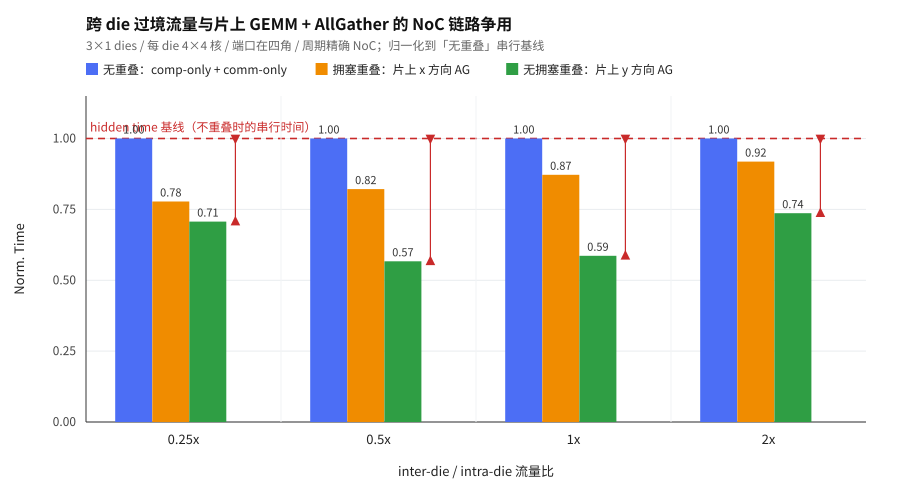

# 跨 die 流量与片上运算流量的 NoC 争用 —— motivation 实验报告

> 本文件由 `run_experiment.py` 自动生成，请勿手工编辑正文里的数字；
> 改参数后重跑脚本即可刷新。设计说明见 [README.md](README.md)。

## 结论

在**总通信量、总计算量、跨 die 链路数量完全相同**的前提下，只把片上
AllGather 的方向从 **y（列）** 换成 **x（行）**，使它与跨 die 过境流量共用
中间 die 的东西向 NoC 链路，端到端时间就显著变长：

* **无拥塞重叠（片上 y 方向 AG）**：跨 die 流量与片上任务**完美重叠**，
  实测相对理想值 `max(W_片上, W_跨die)` 的偏差只有 **<<Y_OVERHEAD_RANGE>>**。
* **拥塞重叠（片上 x 方向 AG）**：同样的两份工作放在一起跑，却比理想值多
  **<<X_OVERHEAD_RANGE>>**。多出来的部分**全部**来自 NoC 物理链路争用 ——
  两个场景的计算量、注入包数、跨 die 包数、per-die 网络活动量都逐项相同。

也就是说：**跨 die 流量并不是「反正走的是 D2D 链路，与片上无关」的独立资源。
它要穿过片上 mesh 才能到达/离开 die 边缘端口，会和片上算子的通信在同一批物理
链路上排队**。重叠能不能省下时间，取决于两股流量在 mesh 上是否相交，而不只是
取决于它们的总量。

## 配置

| 项 | 值 |
|---|---|
| die 阵列 | 3×1（die0 / die1 / die2），每 die **4×4 = 16 核** |
| die 端口 | 只在四个角：W(0,0)、W(0,3) 入，E(3,0)、E(3,3) 出 |
| 被观测的 die | **die1**（中间那片，全局核 16..31） |
| NoC | 周期精确 router（`use_beha_noc=false`），XY 维序路由，`noc_payload_per_cycle=1` |
| D2D | `multi_port=true`、`select_policy=nearest`、`link_bw=1`、`latency=1` |
| 时钟 | `CYCLE = 2 ns` |
| 片上负载 | 每核一个 `Matmul_f(B=1,T=64,C=64,OC=1024)` 分片 + 一次 4-rank 一维 AllGather |
| AllGather 消息 | 每条 point-to-point 1024 B（64 个 128-bit 包），全片共 48 条 |
| 跨 die 负载 | die0 → die2 的 **两条过境流**，向东穿过 die1 的第 0 行和第 3 行 |
| sweep | inter-die 总字节 / 片上 AG 总字节 ∈ {0.25, 0.5, 1, 2} |

三种对照场景（与图 1 一致）：

1. **无重叠**：`comp-only` 与 `comm-only` 分别单独跑，时间相加 —— 即完全不重叠的串行执行；
2. **拥塞重叠**：片上 **x 方向**（行）一维 AG 与跨 die 过境流量同时跑；
3. **无拥塞重叠**：片上 **y 方向**（列）一维 AG 与跨 die 过境流量同时跑。

## 为什么这个设计能把差异干净地归因到链路争用

**跨 die 流量是「过境」的，不占 die1 的任何核。** 它由 die0 的核发出、
die2 的核接收，只是路由上必须穿过 die1：从 W 角端口进来，沿着所在行走 3 跳
mesh，再从 E 角端口出去。因此它与 die1 上的片上任务在时间上天然并行（不存在
「同一个核先发跨 die 再做 AG」这种人为串行），唯一的相遇点就是 mesh 链路。

**两个重叠场景的一切都相同，只有 AG 的方向不同。** 静态路径模型（XY 维序
路由 + `nearest` 端口钉选，与仿真器实现无关地独立算出）给出的 die1 有向链路
共享集合：

* x 方向 AG ∩ 过境流量 = `<<SHARED_X>>` —— 正好是第 0 行和第 3 行的 3 条东向链路各一组；
* y 方向 AG ∩ 过境流量 = `<<SHARED_Y>>`。

仿真器侧的记账也确认两者等价：片上任务单独跑时 die1 的 NoC 发送数
x 方向 <<MESH_ONCHIP>>、y 方向 <<MESH_ONCHIP_Y>>（完全相同），跨 die 单独跑时
die1 的 NoC 发送数 <<MESH_XDIE>>（= 2 条流 × 包数 × 3 跳，与 AG 方向无关）。

## 计时口径：为什么必须扣掉「前导」

仿真开始时 host 有一道**串行屏障**：它要给 workload 里声明的**每一个**核发
CONFIG + WEIGHT 并收齐全部 ACK，之后才放行所有核开始干活。这道屏障的长度只
取决于声明了多少个核，与这些核要干什么无关，日志里以
`Config helper start START data distribution` 标记：

* 声明了 die1 那 16 个计算核的场景（`onchip_*` / `overlap_*`）：前导 **<<PROLOGUE_ON>> ns**；
* 只有 4 个核的纯跨 die 场景（`xdie`）：前导 **<<PROLOGUE_XD>> ns**。

如果直接拿两次运行的**总时间**相减，这 <<PROLOGUE_ON>> − <<PROLOGUE_XD>> ns 的
差会被当成「重叠带来的额外开销」记到重叠场景头上 —— 这是个纯粹的记账假象，
而且它是个**常数**，不随流量比变化，所以在跨 die 流量成为关键路径的 1x / 2x
点上会显得格外扎眼。

因此下面所有数字都用**工作时间** `W = 总时间 − 本次运行自己的前导`。
`无重叠基线 = W_on + W_xd`（`W_on` 取 x/y 中较慢者，对 x 场景更宽松）。
每次运行的 `sim_ns` / `prologue_ns` / `work_ns` 都完整保留在
`results/results.json` 里。

## 主表：时间与归一化

<<MAIN_TABLE>>

片上任务单独跑的总时间：x 方向 <<ONCHIP_X>> ns，y 方向 <<ONCHIP_Y>> ns
（差 1.6%，来自 HOST lane 挂在南侧边缘造成的几何不对称，不影响结论方向 ——
这个差异反而让 x 场景在上表里拿到了更宽松的共用基线）。

## 与「理想完美重叠」的对比

完美重叠的下界是 `max(W_片上, W_跨die)`：两股工作互不干扰地并行。这里理想值
按各自的片上方向取（`ideal_y` 用 `W_onchip_y`、`ideal_x` 用 `W_onchip_x`），
免得把 x/y 之间 1.6% 的几何不对称算成重叠开销。

<<IDEAL_TABLE>>

**y 方向（无拥塞）在每个 sweep 点上都精确等于理想值**：在 1x / 2x 上
`W_overlap_y` 与 `W_xdie` 逐 ns 相同 —— 片上 GEMM + AllGather 被
**100% 藏进**跨 die 传输里，一个周期都没多花。x 方向（拥塞）则系统性地高出
一大截，而且两种场景的工作量完全一样。

## 直接证据：逐 AllGather 组的完成时间

`[FLOW_DONE]` 记录每条 flow 尾包被目的核收下的 cycle。下表是**每个 AG 组内
最后一条 flow 完成的 cycle**，以及两条过境流到达 die2 的 cycle。

<<GROUP_TABLE>>

读法一（延迟落在谁身上）：**过境流量本身几乎没被拖慢**。对比「仅跨 die」行
和两个重叠行，过境流到达 die2 的 cycle 只推后了固定的 <<TRANSIT_DELTA>> cycle，而且
**x 与 y 两个重叠场景推后的量完全一样**（脚本会强制校验这一点，不一致就直接报错）
—— y 场景一条链路都不共享，所以这 <<TRANSIT_DELTA>> cycle 只是「workload 里多了 16 个核，host 配置相变长」的启动偏移，不是
争用。代价**全部**由片上 AllGather 承担：周期精确 router 的输出链路是按 flow
的 tag 上锁串行化的，一条很长的过境 flow 拿到锁之后，片上 AG 的短消息只能排队。

读法二（延迟落在哪条链路上）：在 **拥塞重叠（x）** 里，第 0 组（y=0 行）和第 3 组（y=3 行）—— 也就是
过境流量穿过的那两行 —— 完成时间被大幅推后，而第 1、2 组（y=1、y=2 行，
过境流量碰不到）几乎不受影响，与无跨 die 流量时基本一致。这把延迟精确定位到了
**被共享的那几条链路**，而不是「整片 die 变慢了」。在 **无拥塞重叠（y）** 里，
四个列组的完成时间都与单独跑时相当。

## 适用边界

* 这是一个**确定性的单次 GEMM + 一维 AllGather** 场景，不是对任意流量分布的
  统计性能预测。四个 sweep 点各连续跑两次，所有已解析指标（完成时间、逐 flow
  完成 cycle、per-die 网络活动、D2D 逐链路包数、drain 残留）两次完全一致。
* 端口只在四个角，所以过境流量只碰得到 4 行里的 2 行。如果端口分布更密，
  或者跨 die 流量的源/汇落在 die 内部（而不是过境），受影响的链路会更多，
  拥塞只会更严重，不会更轻。
* AllGather 用「按 rank 分相」的直接展开（第 p 相只有 rank p 发送）。这既是
  避免 REQ→ACK→DATA 阻塞握手形成环形等待的必要结构，也让每一相的流量方向
  明确可算。
* 片上 x/y 两个方向的单独运行时间差 1.6%（HOST lane 几何不对称），已经用
  「取较慢者作基线」的方式吸收掉。
